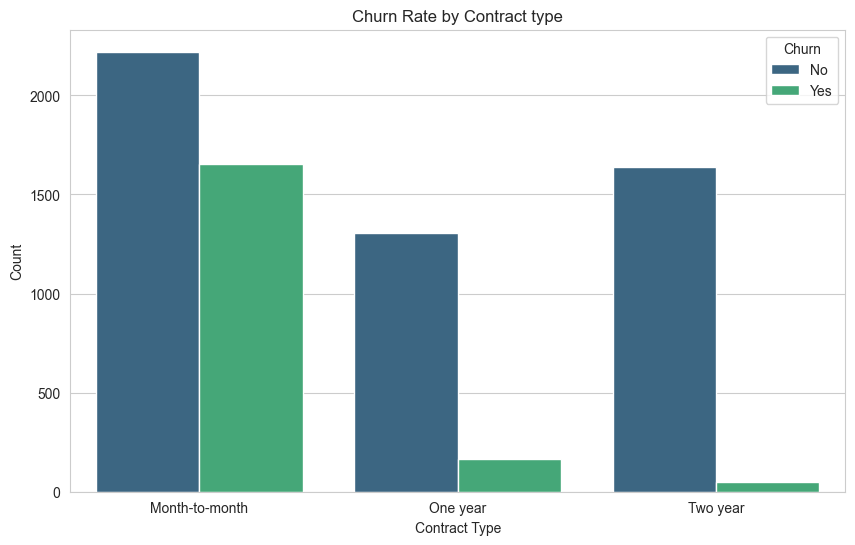
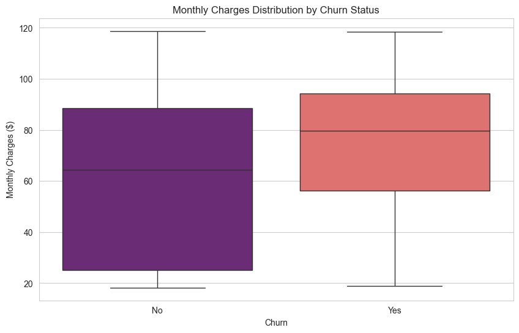

# 📞 Telecom Churn Prediction - Machine Learning

This project aims to identify customers with a high propensity to cancel their services (Churn), enabling the telecommunications company to take proactive retention actions.

## 🚀 Project Status
- [x] Data Cleaning & Pre-processing (Missing Values & Encoding)
- [x] Exploratory Data Analysis (EDA)
- [x] Feature Scaling (StandardScaler)
- [x] Imbalanced Data Handling (Class Weight & Scale Pos Weight)
- [x] Model Benchmarking (Logistic Regression, Random Forest, SVM, and XGBoost)
- [x] Final Model Export (Pickle)

## 📊 Key Business Insights (EDA)
During the analysis, we identified the main churn drivers:
- **Contract Type:** Customers with "Month-to-month" contracts have a drastically higher churn rate.
- **Financial Impact:** Churn is more frequent among customers with higher monthly charges.

<<<<<<< Updated upstream
  
  
=======
  
  
>>>>>>> Stashed changes

## 🤖 Modeling & Performance
For this business problem, we prioritized **Recall**. The goal is to capture as many at-risk customers as possible.

| Model | Recall (Class 1) | Precision (Class 1) | Notes |
| :--- | :---: | :---: | :--- |
| **Logistic Regression** | **0.80** | 0.49 | **Selected Model (Best business trade-off)** |
| **SVM** | 0.82 | 0.45 | High Recall, but lowest Precision |
| **XGBoost** | 0.68 | 0.53 | Robust model, but Recall was below target |
| **Random Forest** | 0.52 | 0.63 | Poor performance on the minority class |

## 🏆 Technical Conclusion
<<<<<<< Updated upstream
**Balanced Logistic Regression** was selected as the final solution. With a **Recall of 0.80**, the model successfully identifies 8 out of 10 potential churners. The implementation 
of **StandardScaler** was crucial to ensure algorithm convergence.
=======
**Balanced Logistic Regression** was selected as the final solution. With a **Recall of 0.80**, the model successfully identifies 8 out of 10 potential churners. The implementation of **StandardScaler** was crucial to ensure algorithm convergence.
>>>>>>> Stashed changes

## 📂 Repository Structure
- `notebooks/`: Full development Jupyter Notebooks.
- `images/`: Analysis and performance plots.
- `model_churn_logistic_balanced.pkl`: Final trained model file.
- `scaler.pkl`: Scaler object required for new predictions.

---
<<<<<<< Updated upstream
**Developed by Rafael Bezerra do Vale** *Data Scientist in Career Transition | Systems Analysis & Development Background*
=======
**Developed by Rafael Bezerra do Vale** *Data Scientist in Career Transition | Systems Analysis & Development Background*
>>>>>>> Stashed changes
